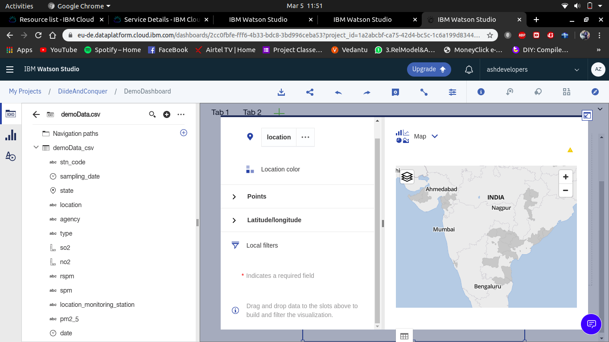

# IBM_WATSON
IBM_WATSON Team Divide And Conquer(AirHexa)

Overview:
  The product which we have built is a AI powered drone for last mile dilvery of the products like delivery parcels, Medicine aid and we have integrated sensors to collect environment data which will monitors and stores the data and is sent to cloud for further analysis of the emission data.
  
  The approach we used to achive the visualization is using IBM WATSON STUDIO, IBM MACHINE LEARNING.
  
  STEP-1
    We created watson studio project in the ibm cloud console. 
    
  STEP-2
    we then added watson machine learning to the project.
    
  STEP-3
   Then we uploaded our custom dataset to the project.
    
  STEP-4
    We got the visualization for the custom dataset as we needed
    
    1. Line Graph and Confusion Matrix
      
